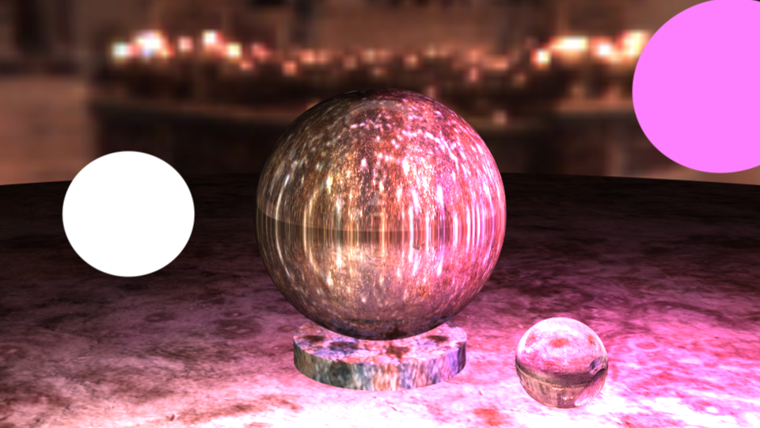

# Task
Realistically display the so-called magic crystal (witch ball) in the form of a crystal ball.  
There are several basic requirements for the visualization of the ball:  
1. The crystal material should behave similarly to glass, that is, refraction and reflection should be realized taking into account Fresnel formulas. The implementation
of full internal reflection is mandatory.  
2. Inside the crystal, a certain scene should appear in the fog or in the dark (depending on your option). The scene should be translucent, imitating fuzzy visions of a fortune teller. Sharp transitions between
the ball material and the scene inside it are not allowed.  
3. The crystal must stand on a stand. In the minimum version of the task --- a square
or cylindrical platform.  
4. There must be at least 2 light sources in the scene. The sources must cast
glare on the glass or have a size and be reflected in it.  
5. Rendering should not take more than 1 minute. If you are afraid that
with a significant number of additionally implemented effects, the speed will drop
below the acceptable threshold, it is necessary to implement progressive (gradual,
clarifying the picture with each pass) rendering.  
6. By default, the image should be rendered in 512x512 resolution (to change
the resolution ‘-w 1024’ in the command line. The image should be square).  
# Output 

# Code
visit https://www.shadertoy.com/view/NdXSWr  
